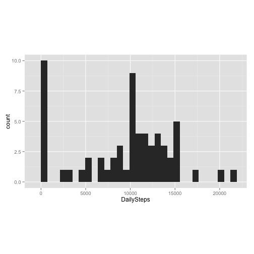
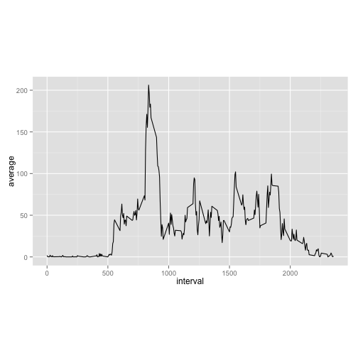
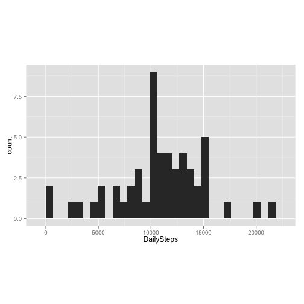

# Reproducible Research: Peer Assessment 1


## Loading and preprocessing the data


```r
dt <- read.csv("activity.csv")
```

--------


## What is mean total number of steps taken per day?

First of all, we calculate the total number of steps per day (ignoring NAs). The data frame *sums* receives the results:

```r
# days=levels(as.factor(dt$date))
library(plyr)
sums <- ddply(dt, .(date), function(d) {
    sum(d$steps, na.rm = TRUE)
})
names(sums)[2] <- "DailySteps"
str(sums)
```

```
## 'data.frame':	61 obs. of  2 variables:
##  $ date      : Factor w/ 61 levels "2012-10-01","2012-10-02",..: 1 2 3 4 5 6 7 8 9 10 ...
##  $ DailySteps: int  0 126 11352 12116 13294 15420 11015 0 12811 9900 ...
```


### 1. Make a histogram of the total number of steps taken each day
Next, we show a histogram with the distribution of total steps per day:

```r
library(ggplot2)
qplot(DailySteps, data = sums, asp = 0.6)
```

```
## stat_bin: binwidth defaulted to range/30. Use 'binwidth = x' to adjust this.
```

 


### 2. Calculate and report the **mean** and **median** total number of steps taken per day

Then calculate the **mean**:

```r
mean(sums$DailySteps)
```

```
## [1] 9354
```


... and the **median**:

```r
median(sums$DailySteps)
```

```
## [1] 10395
```

-----


## What is the average daily activity pattern?

### 1. Make a time series plot (i.e. `type = "l"`) of the 5-minute interval (x-axis) and the average number of steps taken, averaged across all days (y-axis)


```r
interv_ave <- ddply(dt, .(interval), function(x) {
    mean(x$steps, na.rm = TRUE)
})
names(interv_ave)[2] <- "average"
qplot(interval, average, data = interv_ave, geom = "line", asp = 0.6)
```

 


### 2. Which 5-minute interval, on average across all the days in the dataset, contains the maximum number of steps?


```r
max_int <- interv_ave[order(interv_ave$average, decreasing = TRUE)[1], 1]
print(max_int)
```

```
## [1] 835
```


So, the  835th interval contains the maximum number of steps when averaged across all days.
------


## Imputing missing values

### 1. Calculate and report the total number of missing values in the dataset (i.e. the total number of rows with `NA`s)

```r
sum(is.na(dt$steps))
```

```
## [1] 2304
```


### 2. Devise a strategy for filling in all of the missing values in the dataset. The strategy does not need to be sophisticated. For example, you could use the mean/median for that day, or the mean for that 5-minute interval, etc.
The chosen is strategy was to substitute the NAs by the mean of its corresponding interval across all days

### 3. Create a new dataset that is equal to the original dataset but with the missing data filled in.


```r
dt2 <- dt
# dt2[is.na(dt2$steps),1] <-
# interv_ave[dt2[is.na(dt2$steps),3]==interv_ave[,1],2]
dt2$isna <- is.na(dt2[, 1])
dt2 <- ddply(dt2, "isna", function(d) {
    if (d[1, 4]) 
        d = join(d, interv_ave, by = "interval", type = "left")
    return(d)
})
```


### 4. Make a histogram of the total number of steps taken each day and Calculate and report the **mean** and **median** total number of steps taken per day. Do these values differ from the estimates from the first part of the assignment? What is the impact of imputing missing data on the estimates of the total daily number of steps?


```r
# days=levels(as.factor(dt$date))
library(plyr)
sums_subNA <- ddply(dt2, .(date), function(d) {
    sum(d$steps)
})
names(sums_subNA)[2] <- "DailySteps"
str(sums_subNA)
```

```
## 'data.frame':	61 obs. of  2 variables:
##  $ date      : Factor w/ 61 levels "2012-10-01","2012-10-02",..: 1 2 3 4 5 6 7 8 9 10 ...
##  $ DailySteps: int  NA 126 11352 12116 13294 15420 11015 NA 12811 9900 ...
```

Next, we show a histogram with the distribution of total steps per day for the generated data frame with old NAs substituted according with the strategy defined above:

```r
qplot(DailySteps, data = sums_subNA, asp = 0.6)
```

```
## stat_bin: binwidth defaulted to range/30. Use 'binwidth = x' to adjust this.
```

 


The **mean**:

```r
mean(sums_subNA$DailySteps)
```

```
## [1] NA
```


... and the **median**:

```r
median(sums_subNA$DailySteps)
```

```
## [1] NA
```

------


## Are there differences in activity patterns between weekdays and weekends?
